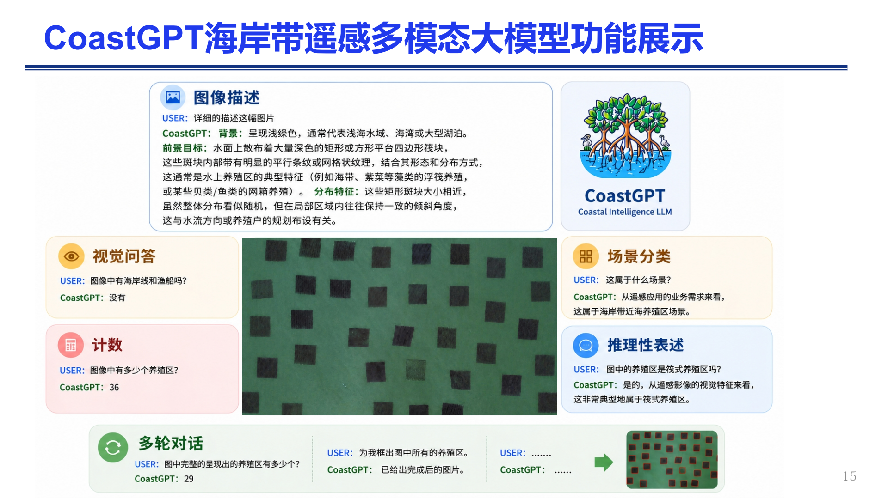
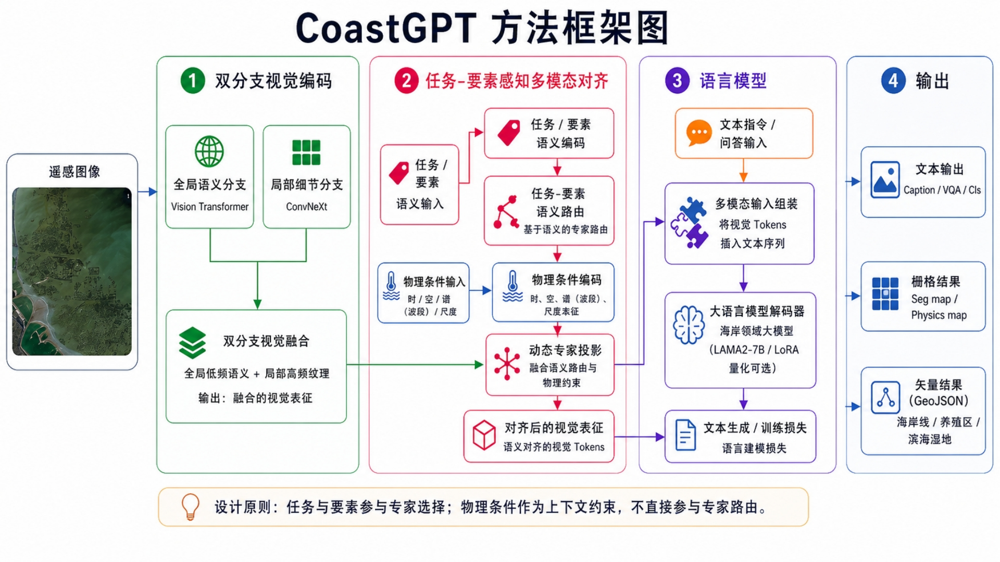
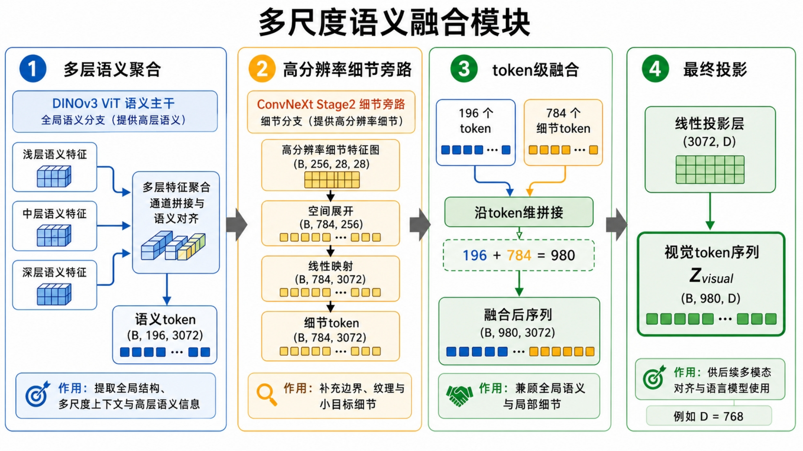

# CoastGPT:融合多模态感知与结构化输出的海岸带遥感解译大模型

[](https://www.python.org/) [](https://pytorch.org/) [](https://github.com/microsoft/DeepSpeed) [](https://www.hiascend.com/)

---

## Introduction

CoastGPT：融合多模态感知与结构化输出的海岸带遥感解译大模型

当前的项目说明文档仅收录已具备公开条件的技术内容：

- 模型架构
- 运行环境与模型部署准备
- 训练
- 推理与测试流程



---

## Main Capabilities

CoastGPT 旨在支持以下海岸带遥感任务：

| 任务（Task）                          | 功能描述                                                                                                                                                   |
| ------------------------------------- | ---------------------------------------------------------------------------------------------------------------------------------------------------------- |
| 图像描述（Image Captioning）          | 为海岸带场景生成自然语言描述                                                                                                                               |
| 视觉问答（Visual Question Answering） | 针对海岸带遥感影像回答相关问题                                                                                                                             |
| 视觉定位（Visual Grounding）          | 根据自然语言指令定位目标或对应区域                                                                                                                         |
| 场景分类（Scene Classification）      | 识别海岸带场景所属类别                                                                                                                                     |
| 目标计数（Object Counting）           | 统计养殖筏等海岸带目标的数量                                                                                                                               |
| 多轮对话（Multi-turn Dialogue）       | 支持用户基于海岸带遥感影像开展上下文关联的连续自然语言交互，可动态调整解译需求、递进式完成多步骤遥感解译任务，完整保留对话历史的语义承接与用户业务意图理解 |

---

## Model Architecture

CoastGPT 采用适配海岸领域任务的视觉-语言架构。整体框架包含四大核心组件：

1. **双分支视觉编码器**：实现全局与局部感知；
2. **多尺度语义融合模块**：完成视觉词元聚合；
3. **任务元素感知语义路由模块**：实现稀疏专家激活；
4. **大语言模型解码器**：用于指令遵循与结构化输出生成；



### 双分支视觉编码

滨海遥感影像同时包含大尺度地理结构与细粒度局部地物。因此CoastGPT采用双分支视觉编码策略：

- **全局视觉分支**：用于捕捉场景级与长距离空间结构；
- **局部细节分支**：用于识别养殖筏、海岸线边界、湿地斑块、藻华区域等细粒度地物。

### 多尺度语义融合



多尺度融合模块聚合分层视觉表征，并将其映射至大语言模型的词元空间。该设计能够让模型同时保留：

- 全局语义上下文；
- 局部边界与纹理细节。

### 任务-要素感知的语义路由


CoastGPT 引入了一种语义路由机制，同时兼顾两大维度：

- **任务类型**：分类、视觉问答、视觉定位、图像描述、信息提取；
- **海岸要素**：养殖区、海岸线、滨海湿地、绿潮等。

该路由策略旨在减轻多任务学习中的特征冲突，提升专家模块的专用性与适配能力。

---

## Project Structure

```text
CoastGPT/
├── Configs/                 # Training and model configuration files
├── Dataset/                 # Dataset loading and preprocessing modules
├── Eval/                    # Evaluation scripts and metrics
├── Images/                  # Example images
├── Models/                  # CoastGPT model definitions
├── Serve/                   # Serving / deployment interfaces
├── Tools/                   # Utility tools
├── Trainer/                 # Training engine, hooks, and utilities
├── transformers/            # Customized transformer components
├── Inference.py             # Interactive inference entry
├── train_stage_one.py       # Stage-1 training entry
├── train_stage_one.sh       # Stage-1 training script
├── train_stage_two.py       # Stage-2 training entry
├── train_stage_two.sh       # Stage-2 training script
├── requirements.txt
└── README.md
```

---
## Model Download

Pretrained models are available on Hugging Face: [cuibinge/CoastGPT](https://huggingface.co/cuibinge/CoastGPT)

## Preparation

### 1. System Requirements

| Component               | Recommended Setting      |
| ----------------------- | ------------------------ |
| Python                  | 3.10                     |
| Package manager         | Conda                    |
| Deep learning framework | PyTorch                  |
| Distributed training    | DeepSpeed                |
| Hardware                | NVIDIA GPU or Ascend NPU |

### 2. Installation

```bash
# Clone repository
git clone git@github.com:cuibinge/CoastGPT.git
cd CoastGPT

# Create environment
conda create -n CoastGPT python=3.10
conda activate CoastGPT

# Install dependencies
pip install -r requirements.txt
```

### 3. CheckPoints

```text
CheckPoints
├── FINAL.pt
└── TextLoRA/
    ├── adapter_config.json
    └── adapter_model.safetensors
```

---

## Training

### Stage 1

Run:

```bash
bash train_stage_one.sh
```

Or manually:

```bash
#!/usr/bin/env bash
OUTPUT_PATH="./Checkpoints"  # Path to save the output
DATA_PATH="../Data/PretrainData"  # Path to the step_one dataset
SCRIPT_PATH=./train_stage_one.py
CONFIG_PATH=./Configs/step1_dual.yaml
deepspeed \
    --num_node=1 \
    --num_gpus=2 \
    "$SCRIPT_PATH" \
    -c \
    "$CONFIG_PATH" \
    --batch-size 4 \
    --workers 2 \
    --data-path "$DATA_PATH" \
    --output "$OUTPUT_PATH" \
    --accelerator "npu" \
    --enable-amp True \
    --use-checkpoint \
    --wandb False \
    --name "stage1"

```

### Stage 2

Run:

```bash
bash train_stage_two.sh
```

Or manually:

```bash
#!/usr/bin/env bash

MODEL_PATH="" # Path to the Stage1 model
OUTPUT_PATH=""  # Path to save the output
DATA_PATH=""  # Path to the Stage 2 dataset
CONFIG_PATH=./Configs/step2_dual.yaml
SCRIPT_PATH=./train_stage_two.py
deepspeed \
    --num_node=1 \
    --num_gpus=8 \
    "$SCRIPT_PATH" \
    -c \
    "$CONFIG_PATH" \
    --batch-size 4 \
    --workers 2 \
    --data-path "$DATA_PATH" \
    --output "$OUTPUT_PATH" \
    --accelerator "gpu" \
    --enable-amp True \
    --use-checkpoint

```

---

## Evaluation

Evaluation scripts and metrics are placed under:

```text
Eval/
```

场景分类

```sh
python Eval/eval_cls.py \
-c Configs/inference.yaml \ 
--batch-size 8 \
--data-path <scene_cls_dataset_root> \ 
--model-path <checkpoint> \
--accelerator gpu \
--output output/cls
```

视觉问答

```bash
python Eval/eval_vqa.py \
-c Configs/inference.yaml \ 
--dataset-name RSVQA_HR \
--data-path <vqa_dataset_root> \ 
--split test \
--batch-size 8 \ 
--model-path <checkpoint> \ 
--accelerator gpu \
--output output/vqa
```

视觉定位

```bash
python Eval/eval_vg.py 
-c Configs/inference.yaml 
--batch-size 8 
--data-path <vg_image_dir> 
--data-target <vg_annotation_json> 
--model-path <checkpoint> 
--accelerator gpu 
--output output/vg
```

---

## Acknowledgement

本研究的实验与计算工作依托于华为昇腾AI云服务平台完成，特此对其提供的稳定算力支持表示感谢。

The experimental and computational work in this research run on the Huawei Cloud Al Compute Service. We appreciate the stable compute supply from this platform.
