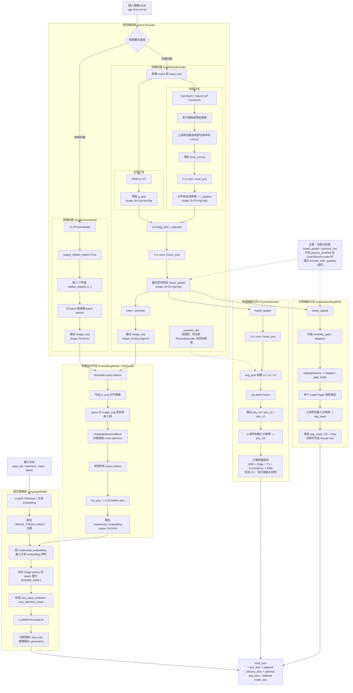

# CoastGPT Structure

```mermaid
flowchart TD

    A1["输入图像 RGB<br/>rgb: B×C×H×W"]
    A2["输入文本<br/>input_ids / attention_mask / labels"]

    N0["注意：当前代码里 fused_spatial / pyramid_raw<br/>只在 physics_enabled 且 DualVisionEncoder 时<br/>通过 encode_with_spatial() 返回"]

    subgraph V [视觉编码层 Vision Encoder]
        direction TB
        V0{"视觉模式选择"}

        subgraph VS [单编码器 SingleVisionModel]
            direction TB
            VS1["CLIPVisionModel"]
            VS2["output_hidden_states=True"]
            VS3["取 3 个阶段 hidden_states[:,1:,:]"]
            VS4["沿 token 维拼接 patch tokens"]
            VS5["输出 image_seq<br/>shape: B×N×Dv"]
        end

        subgraph VD [双编码器 DualVisionEncoder]
            direction TB
            VD1["图像 resize 到 input_size"]

            subgraph VDg [全局分支]
                VDg1["DINOv3 ViT"]
                VDg2["得到 g_grid<br/>shape: B×Cg×Hg×Wg"]
            end

            subgraph VDl [局部分支]
                VDl1["ConvNeXt / OpenCLIP ConvNeXt"]
                VDl2["多尺度局部特征提取"]
                VDl3["上采样到最高局部分辨率后 concat"]
                VDl4["得到 local_concat"]
                VDl5["1×1 conv: local_proj"]
                VDl6["对齐到全局网格 -> l_aligned<br/>shape: B×Cl×Hg×Wg"]
            end

            VD3["concat(g_grid, l_aligned)"]
            VD4["1×1 conv: fusion_proj"]
            VD5["融合空间特征 fused_spatial<br/>shape: B×Cf×Hg×Wg"]
            VD6["view + permute"]
            VD7["输出 image_seq<br/>shape: B×(Hg·Wg)×Cf"]
            VD8["pyramid_raw<br/>会返回，但当前 PhysicsDecoder 未实际使用"]
        end
    end

    subgraph M [多模态对齐层 EmbeddingModel / AttnPooler]
        direction TB
        M1["learnable query tokens"]
        M2["可选 in_proj 对齐维度"]
        M3["query 与 image_seq 各自切成 3 段"]
        M4["ResidualAttentionBlock<br/>对每段做 cross-attention"]
        M5["拼回所有 query tokens"]
        M6["out_proj -> LLM hidden size"]
        M7["得到 multimodal_embedding<br/>shape: B×Q×Dt"]
    end

    subgraph L [语言建模层 LanguageModel]
        direction TB
        L1["LLaMA Tokenizer / 文本 embedding"]
        L2["查找 <image> / IMAGE_TOKEN_INDEX 位置"]
        L3["把 multimodal_embedding 插入文本 embedding 序列"]
        L4["对应 image tokens 的 labels 置为 IGNORE_INDEX"]
        L5["形成 new_input_embeds / new_attention_mask"]
        L6["LLaMAForCausalLM"]
        L7["训练输出: text_loss<br/>推理输出: generate()"]
    end

    subgraph P [物理辅助分支 PhysicsDecoder]
        direction TB
        P1["fused_spatial"]
        P2["1×1 conv: fused_proj"]
        P3["avg_pool 构建 s1 / s2 / s3"]
        P4["top-down fusion"]
        P5["输出 phy_s3 / phy_s2 / phy_s1"]
        P6["上采样到输入分辨率 -> phy_full"]
        P7["计算物理损失<br/>MSE + Edge + TV + Consistency + SAM<br/>若无 GT，则只保留正则项"]
    end

    subgraph S [分割辅助分支 AquacultureSegMOE]
        direction TB
        S1["fused_spatial"]
        S2["可选 modality_gate / adapters"]
        S3["GatingNetwork -> weights / gate_logits"]
        S4["多个 expert logits 加权融合"]
        S5["上采样到输入分辨率 -> seg_logits"]
        S6["若有 seg_mask: CE + Dice<br/>训练时可加 Router Aux"]
    end

    T1["total_loss<br/>= text_loss + optional physics_loss + optional seg_loss + optional router_aux"]

    A1 --> V0
    V0 -->|单编码器| VS1
    VS1 --> VS2 --> VS3 --> VS4 --> VS5

    V0 -->|双编码器| VD1
    VD1 --> VDg1 --> VDg2
    VD1 --> VDl1 --> VDl2 --> VDl3 --> VDl4 --> VDl5 --> VDl6
    VDg2 --> VD3
    VDl6 --> VD3
    VD3 --> VD4 --> VD5 --> VD6 --> VD7

    VS5 --> M1
    VD7 --> M1
    M1 --> M2 --> M3 --> M4 --> M5 --> M6 --> M7

    A2 --> L1 --> L2 --> L3 --> L4 --> L5 --> L6 --> L7
    M7 --> L3

    VD5 --> P1
    VD5 --> S1
    VD8 -.-> P3
    N0 -.-> VD5
    N0 -.-> S1

    P1 --> P2 --> P3 --> P4 --> P5 --> P6 --> P7
    S1 --> S2 --> S3 --> S4 --> S5 --> S6

    L7 --> T1
    P7 --> T1
    S6 --> T1

```
